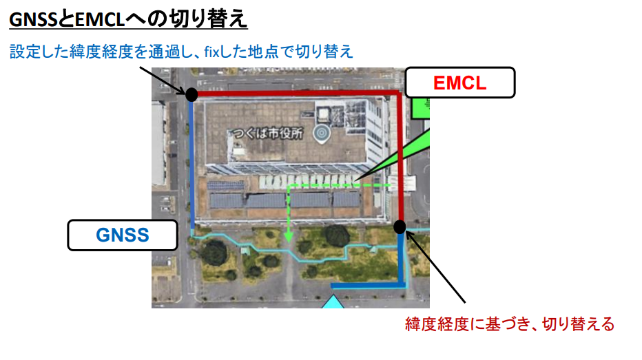

# 設計仕様書: LocalizationSwitcher

## 1. ノード概要

### 1.1. 目的と役割
`LocalizationSwitcher` は、2つの自己位置推定ライフサイクルノード`gnss_node` と `emcl2`を管理する**マネージャーノード**である.

特定の条件下において、どちらか一方のノードのみが `active` 状態になるよう状態遷移を指令し、システム全体として単一の信頼できる自己位置推定情報が出力されることを保証する。

### 1.2. 管理対象ノード

| No. | ノード名 (デフォルト) | 役割 |
|:---:|:---|:---|
| 1 | `gnss_node` | GNSSを利用した自己位置推定 |
| 2 | `emcl2` | LIDARベースの自己位置推定 |

### 1.3. 切り替え条件

`/ublox_gps_node/fix` 及び `/gnss_pose` トピックを監視し、GNSSの信頼性を判定する。

- **(A) 屋外 → 屋内**: GNSSの信頼性が低下した場合、`[other_node_name]` に切り替える。
- **(B) 屋内 → 屋外**: GNSSの信頼性が十分に回復した場合、`gnss_node` に切り替える。

*(詳細なロジック、閾値、ヒステリシスは別途定義)*

---

## 2. 入出力設計

### 2.1. 入力 (Subscribe)

| トピック名 | 型 | 説明 |
|:---|:---|:---|
| `/ublox_gps_node/fix` | `sensor_msgs::msg::NavSatFix` | GNSSの受信状態や測位モード（FIX状態）を取得 |
| `/gnss_pose` | `geometry_msgs::msg::PoseStamped` | GNSSベースの現在位置情報を取得 |

### 2.2. 出力 (Service Call)

本ノードはトピックをPublishしない。代わりに、管理対象ノードのライフサイクルサービスを呼び出すことで状態遷移を指令する。

| サービス名 | 型 | 説明 |
|:---|:---|:---|
| `/gnss_node/change_state` | `lifecycle_msgs::srv::ChangeState` | `gnss_node`の状態遷移を指令 |
| `/emcl2/change_state`| `lifecycle_msgs::srv::ChangeState` | `emcl2`の状態遷移を指令 |

---

## 3. 処理フロー

*(このセクションは、1.3. の切り替え条件詳細が確定した後に、具体的なフロー図またはシーケンス図に更新する)*

1.  **[初期化]** サブスクライバとサービスクライアントを作成。管理対象ノードを両方 `configure` し、`inactive`状態にする．その後直ちにデフォルト側を `activate` 状態にする。
2.  **[待機]** `/ublox_gps_node/fix` , `/gnss_pose` トピックの受信を待つ。
3.  **[条件判定]** トピック受信時に、切り替え条件ロジックを実行する。
4.  **[状態遷移指令]** 切り替え条件を満たした場合、現在 `active` なノードを `deactivate` し、次に `active` にするノードを `activate` するサービスコールを実行する。
5.  **[状態更新]** 内部で保持している現在のアクティブノード情報を更新し、[待機]に戻る。

---

## 4. 起動設定 (パラメータ)

本ノードはLaunchファイルから以下のパラメータを受け取ることで、柔軟な設定変更に対応する。これらパラメータは`config/params.yaml`から読み込む．

| パラメータ名 | 型 | デフォルト値 | 説明 |
|:---|:---|:---|:---|
| `gnss_node_name` | `string` | `"gnss_node"` | 管理対象のGNSSノード名 |
| `emcl2_node_name`| `string` | `"emcl2"` | 管理対象のもう一方のノード名 |
| `default_active_node`| `string` | `"gnss_node"`| 起動時に最初にアクティブにするノード名(今回は`gnss_node`をデフォルトとして設定する) |

---

## 5. クラス設計

### 5.1. クラス名
`LocalizationSwitcher`

### 5.2. 主要なメンバ変数

| 変数名 | 型 | 説明 |
|:---|:---|:---|
| `sub_fix_` | `rclcpp::Subscription` | `/fix` トピック用サブスクライバ |
| `sub_pose_` | `rclcpp::Subscription` | `/gnss_pose` トピック用サブスクライバ |
| `client_gnss_` | `rclcpp::Client` | `gnss_node` 制御用サービスクライアント |
| `client_emcl2_` | `rclcpp::Client` |  `emcl2_node` 制御用サービスクライアント  |
| `current_active_node_` | `std::string` | 現在アクティブなノード名を保持 |
| *(その他)* | - | 切り替え判定ロジックに必要な変数 (タイマー、カウンタ等) |

### 5.3. 主要なメンバ関数

| 関数名 | 役割 |
|:---|:---|
| `fix_callback()` | `/fix` 受信時の処理 |
| `pose_callback()` | `/gnss_pose` 受信時の処理 |
| `change_node_state()`| 状態遷移を安全に実行するためのヘルパー関数 |
| `initialize_nodes()` | 起動時に管理対象ノードを初期化する関数 |

